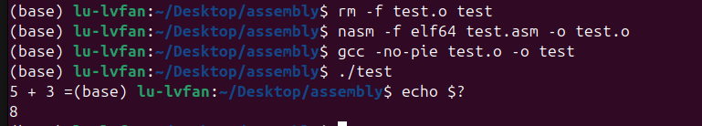

# DOSBox Usage Tutorial

In this section, we will try to assign values to registers and use the debug tool to observe the assignment results.

## Instruction

Add the `MOV AX, 1680H` instruction to the program. Its function is to load the value 1680H into the AX register.

The complete code is as follows:

``` asm
; proj_03.asm - DOS .COM format
org 100h          ; .COM file starting address (fixed)

; ========== Data Segment ==========
section .data
    ; Define data here

; ========== Code Segment ==========
section .text
start:
    ; Program entry point
    MOV AX, 1680H   ;
    
    ; Program exit
    MOV AH, 4Ch    ; DOS exit function
    MOV AL, 0      ; Return code (optional)
    INT 21h        ; Call DOS interrupt
```


## Running Code

Run the following commands in the Linux terminal:
``` bash
# Compile code
nasm -f bin proj_03.asm -o proj_03.com

# Start DOSBox (can use another terminal window)
dosbox
```

Run the following commands in DOSBox:
``` batch
REM Mount current workspace as DOS C: drive, modify to actual path
mount C ~/Desktop/assembly

REM Switch to file directory
C:

REM Execute code
proj_03.com
```

Notes:
1. `#` is a comment for bash commands, `REM` is the standard comment command for DOS commands

2. This assembly code itself has no visible output, so there is no obvious feedback in the console after execution.


## DOS Debug Tool

To facilitate debugging of assembly commands, we need the DOS debug tool. Readers can download DOS tools from online platforms, for example:

https://github.com/FDOS/kernel?tab=readme-ov-file FreeDOS

For the convenience of readers, we have provided a debugger in the project root directory at the path: `debug.exe`. If accidentally deleted, you can also extract the `backup/DEBUG.zip` file and place a copy back in the root directory.


Common DEBUG commands are as follows:

| Command | Description |
|---------|------------|
| q | Quit DEBUG |
| r | Display all registers |
| r ax | Display specific register (e.g., AX) |
| u | Unassemble code |
| u 100 | Unassemble from address 100h |
| t | Trace (execute one instruction) |
| p | Proceed (execute one instruction, skip INT calls) |
| g | Go (run program to end) |
| g 105 | Run to address 105h and stop (set breakpoint) |
| d | Dump (display memory contents) |
| d 100 | Display memory from address 100h |


To debug code, you can run the following commands in DOSBox:

```
REM Execute code in debug mode
debug proj_03.com

REM Unassemble from address 100h
u 100

REM Execute one instruction step by step
t
```

The running effect is shown in the figure below. You can observe that the `AX` register value is `1680H`, which is the value we set through the `MOV` command.
